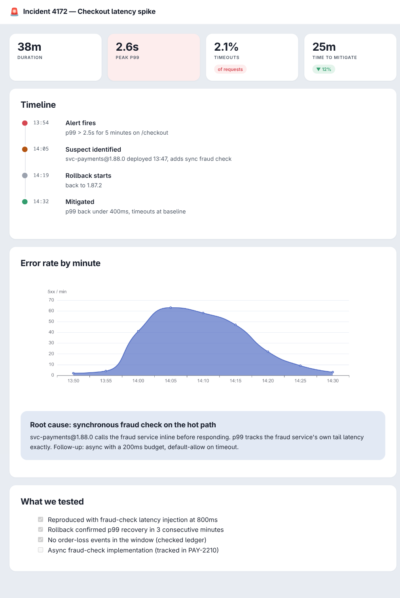

# opencode-artifacts

Publish OpenCode session output as self-contained, interactive HTML artifact pages.

[](LICENSE)



Inspired by [Claude Code Artifacts](https://code.claude.com/docs/en/artifacts), rebuilt as a
local-first, open-source [OpenCode](https://opencode.ai) plugin. The model writes Markdown + JSON specs; a fixed
renderer owns the HTML/CSS, so page quality doesn't depend on the model's design skills and
output stays diff-friendly and cheap in tokens.

## Contents

- [Features](#features)
- [Install](#install)
- [Usage](#usage)
- [Authoring format](#authoring-format)
- [Sharing and hosting](#sharing-and-hosting)
- [Limitations](#limitations)
- [Development](#development)
- [Roadmap](#roadmap)
- [Parity with Claude Code Artifacts](#parity-with-claude-code-artifacts)
- [Contributing](#contributing)
- [License](#license)

## Features

- **Dashboards, PR walkthroughs, incident timelines, checklists, comparisons** — component fences (`stats`, `timeline`, `findings`, `compare`, `callout`, `progress`, `diff`, `copy`, `mermaid`, `decisions`) plus Vega-Lite / Vega / ECharts / Mermaid charts, all inlined into one strict-CSP file
- **Curated themes**: frontmatter `theme: report | ops | editorial` restyles the whole page — [one source, three identities](docs/evidence/patterns/funnel-report.png)
- **Gallery + versions**: every publish updates `.opencode/artifacts/index.html`; `version: true` keeps numbered history; `restore` rolls back; a stale-version hash guard prevents blind overwrites
- **Interactive**: chart-bound controls (vega-lite `params.bind`, echarts `dataZoom`), text-selection comments, workshop decision pages the session can read back
- **Live reload**: `opencode-artifacts serve` refreshes open pages on every republish
- **Sharing**: cost-free public hosting via GitHub Pages, or authenticated hosting via Cloudflare Workers + KV + Access
- **Safe by default**: no raw HTML passthrough, credential-pattern scan blocks accidental secret leaks, no external requests at view time

## Install

```bash
npm install opencode-artifacts
```

Add to your `opencode.json`:

```json
{
  "$schema": "https://opencode.ai/config.json",
  "plugin": ["opencode-artifacts"]
}
```

OpenCode installs npm plugins (and their dependencies) automatically at startup. Non-registry
specs work too — for a local checkout (after `npm install && npm run build`):

```json
{
  "plugin": ["file:///absolute/path/to/opencode-artifacts"]
}
```

Optional, for hosted deploys — the wizard asks once whether and where to deploy and writes the
answer to `.opencode/artifacts.json` (`--global` for all projects):

```bash
npx opencode-artifacts init
# non-interactive: npx opencode-artifacts init --yes --target github --repo you/artifacts
```

## Usage

In a session, just ask:

> Summarize this incident investigation and publish it as an artifact with a timeline and an error-rate chart.

The agent calls the `artifact_publish` tool with Markdown like:

````markdown
---
title: Incident 4172 — Checkout latency spike
icon: 🚨
description: p99 spike traced to a sync fraud-check call
---

```stats
[{ "label": "PEAK P99", "value": "2.6s", "tone": "bad", "emphasis": true }]
```

```vega-lite
{ "data": { "values": [...] }, "mark": "bar", "encoding": { ... } }
```
````

and gets back `Artifact published to <worktree>/.opencode/artifacts/incident-4172-checkout-latency-spike.html`.

For proactive behavior (the agent publishes on its own when output suits a page), enable the
plugin option:

```json
{
  "plugin": [["opencode-artifacts", { "proactive": true }]]
}
```

This injects the bundled guidance (adapted from Claude Code's artifact-design skill) into the
session's system context — visible in the plugin source, off by default, and removable by
deleting the option. Alternative for non-plugin environments: `cp -r skills/artifact-pages
~/.agents/skills/` (don't use both).

CLI (also usable standalone, `npm install -g opencode-artifacts`):

```bash
opencode-artifacts render page.md --open --version   # render + open + keep version history
opencode-artifacts serve                             # http://127.0.0.1:4173, live reload
opencode-artifacts restore <slug> --version 1        # roll the stable page back
opencode-artifacts latest --open                     # reopen the most recent artifact
opencode-artifacts state <slug>                      # read workshop answers back
```

## Authoring format

Full reference: [`docs/component-spec.md`](docs/component-spec.md). Short version:

- **Frontmatter**: `title`, `icon` (emoji favicon), `description` (gallery subtitle)
- **Components** (JSON fences): `stats` metric cards, `timeline`, `findings` (severity-coded), `compare` variant cards, `callout` insight cards, `progress`, `diff` (annotated), `copy` (copy-to-session button), `decisions` (workshop rows the session reads back via `artifact_state`)
- **Charts/diagrams**: ```` ```vega-lite ```` / ```` ```vega ```` / ```` ```echarts ```` / ```` ```mermaid ```` fences; runtimes inline only when used
- **Markdown extras**: GitHub alerts (`> [!WARNING]` etc.), task lists, heading anchors, `##` sections become cards
- Broken specs degrade to inline error boxes; the page always ships

Worked examples for every canonical pattern: [`examples/patterns/`](examples/patterns/) with
browser-verified screenshots in [`docs/evidence/patterns/`](docs/evidence/patterns/).

## Sharing and hosting

| Target | Command | You get |
|---|---|---|
| Local files | (default) | `.opencode/artifacts/<slug>.html` + gallery |
| Live preview | `opencode-artifacts serve` | localhost gallery, SSE live reload, comments/decisions/mini-DB persistence |
| GitHub Pages | `opencode-artifacts deploy --repo you/artifacts` | public URL per artifact; git history as audit log ([live demo](https://bitgorust.github.io/artifacts/)) |
| Cloudflare | `deploy --target cloudflare --name my-artifacts` | Workers + KV hosted gallery; comments/decisions/DB work hosted; add Access for org auth — [guide](docs/hosted-cloudflare.md) |

## Limitations

- Local-first: without a deploy target, artifacts are files on your machine — no share links
- Viewer-identity MCP data calls (Claude Code's connector model) need hosted infrastructure we don't run; the datasource bridge executes local shell commands only, and only under `serve`
- Raw per-page JavaScript (drag-drop boards etc.) is only possible in `format: "html"` mode, which opts out of the fixed renderer's guarantees

## Development

```bash
npm install
npm test        # node --test, no framework
npm run build   # tsc -> dist/
```

## Roadmap

- Comment authorship via Cloudflare Access identity headers
- Syntax highlighting, PDF export

## Parity with Claude Code Artifacts

Full capability inventory (extracted from the Claude Code 2.1.232 binary), feature matrix,
and verified QA log: [`docs/claude-code-comparison.md`](docs/claude-code-comparison.md).

## Contributing

Issues and PRs welcome at
[github.com/bitgorust/opencode-artifacts](https://github.com/bitgorust/opencode-artifacts/issues).
Please run `npm test` before submitting; add a test for every behavior change. For anything
visual, attach a browser screenshot.

## License

[MIT](LICENSE) © bitgorust
