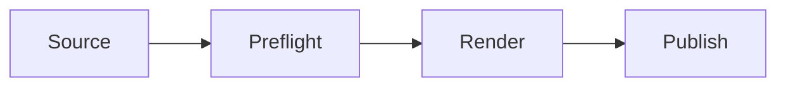

# Renderer multi-runtime benchmark

## Vega-Lite trend

```vega-lite
{"description":"Throughput rises from 12 to 21 units across four samples.","width":"container","height":260,"data":{"values":[{"sample":"A","value":12},{"sample":"B","value":15},{"sample":"C","value":18},{"sample":"D","value":21}]},"mark":"line","encoding":{"x":{"field":"sample","type":"ordinal"},"y":{"field":"value","type":"quantitative"}}}
```

## ECharts distribution

```echarts
{"description":"The accepted category is 84 and the rejected category is 16.","xAxis":{"type":"category","data":["accepted","rejected"]},"yAxis":{"type":"value"},"series":[{"type":"bar","data":[84,16]}]}
```

## Mermaid flow



```decisions
{"title":"Benchmark interaction","questions":[{"id":"continue","question":"Continue?","options":[{"id":"yes","label":"Yes"},{"id":"no","label":"No"}]}]}
```
