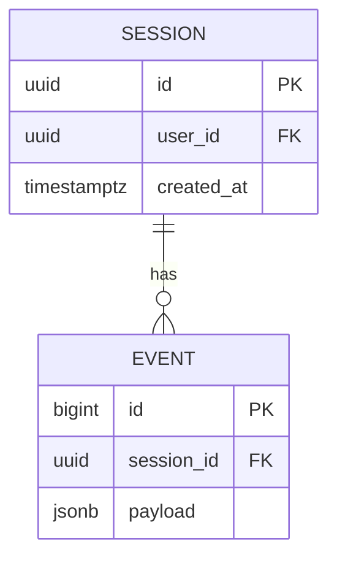

```progress
{ "label": "Plan confidence", "done": 4, "total": 6 }
```

## Approach

Move session storage from Redis to Postgres over three deploys, keeping both stores live until cutover.

```timeline
[
  { "time": "Phase 1", "title": "Dual-write", "detail": "write to Redis and Postgres, read from Redis", "tone": "neutral" },
  { "time": "Phase 2", "title": "Backfill + verify", "detail": "replay 30 days, row-count and checksum parity", "tone": "warn" },
  { "time": "Phase 3", "title": "Cutover", "detail": "read from Postgres, Redis kept warm for 7 days", "tone": "good" }
]
```

## Schema sketch



## Risks

```findings
[
  { "severity": "medium", "title": "Dual-write failure drift", "location": "src/sessions/store.ts", "detail": "One store succeeding while the other fails silently desynchronizes reads after cutover." },
  { "severity": "low", "title": "Index choices unverified at 30-day volume", "location": "migrations/0412", "detail": "Bench before Phase 2 sign-off." }
]
```

## Open questions

- [ ] Retention policy for anonymous sessions
- [x] Connection pool sizing (answered: 20/pod)
