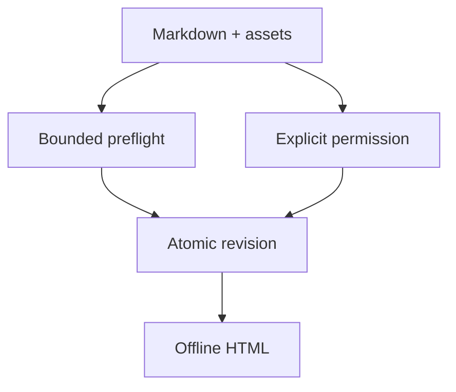

The publication path separates authoring input, validation, permission, durable storage, and
viewing. The decisive property is that opening the final HTML grants no network or filesystem
authority.

## Data flow and boundaries



## What crosses each boundary

```table
{
  "caption": "Publication boundary inventory",
  "columns": [
    { "key": "boundary", "label": "Boundary" },
    { "key": "allowed", "label": "Allowed data" },
    { "key": "authority", "label": "Authority added" }
  ],
  "rows": [
    { "boundary": "Input → preflight", "allowed": "Markdown and explicitly declared contained assets", "authority": "None" },
    { "boundary": "Preflight → permission", "allowed": "Bounded diagnostics and mutation summary", "authority": "None" },
    { "boundary": "Permission → commit", "allowed": "Approved exact artifact mutation", "authority": "Local write only" },
    { "boundary": "Datasource → loopback service", "allowed": "Registered fixed command and bounded captured result", "authority": "Separate execution permission" },
    { "boundary": "Portable HTML → viewer", "allowed": "Embedded page bytes", "authority": "None; connect-src is none" }
  ]
}
```

## Offline viewer frame

```frame
{
  "kind": "mockup",
  "title": "portable-artifact.html",
  "caption": "The viewer receives one embedded HTML file and no network or filesystem authority.",
  "content": "Incident 4172\n\nPrimary finding\nCheckout p99 reached 2.6 s after a synchronous fraud check.\n\nData: synthetic incident log · captured 2026-08-18\nNetwork requests: 0",
  "annotations": [
    "Finding and provenance remain readable offline",
    "The strict CSP leaves connect-src set to none"
  ]
}
```

```callout
{ "tone": "info", "title": "Reader decision", "body": "Use the portable HTML for offline review. Start the loopback service only when comments, decisions, or an explicitly registered datasource are required." }
```
